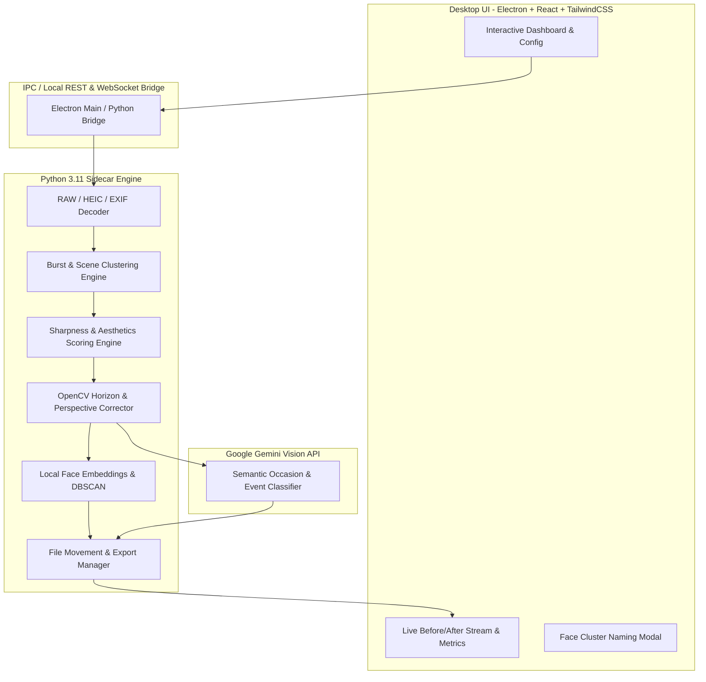

# Product Requirements Document (PRD)
## Project Name: LuminaSort (Intelligent Photo Organizer & Auto-Enhancement System)

**Document Version:** 1.1.0  
**Target Platform:** Windows 10/11 Desktop Application  
**Architecture:** Electron + React (Modern Dark UI) with Python Sidecar Engine  
**AI & Processing:** Hybrid (Local Computer Vision + Google Gemini Vision API)  
**Status:** Finalized Specification  

---

## 1. Executive Summary & Vision

Every photo dump—whether from a wedding, family gathering, vacation, or studio session—contains hundreds of chaotic files, burst duplicates with closed eyes or blurry focus, tilted horizons, and generic camera filenames.

**LuminaSort** is an intelligent desktop application that automates the end-to-end post-capture workflow:
1. **Intelligent Ingestion:** Ingests JPG, PNG, Apple HEIC, and DSLR/Mirrorless RAW files (`.cr2`, `.cr3`, `.nef`, `.arw`, `.dng`).
2. **Best Frame Selection:** Groups burst and duplicate shots, scoring them on sharpness, composition, and facial expression quality to pick the single best frame.
3. **Conditional Perspective & Tilt Correction:** Automatically detects crooked horizons or keystoning and straightens them with smart inscribed cropping—*only executing when correction is actually needed*.
4. **Hybrid Occasion & Person Tagging:** Leverages Google Gemini Vision for rich occasion classification and local face embeddings for fast, private person clustering.
5. **Standardized Hierarchy:** Organizes outputs into clean `[Date]/[Occasion]/[Person or Category]/` folder trees, with non-selected burst frames safely moved to `_archive` and original RAWs preserved in `_originals`.

---

## 2. System Architecture & Tech Stack



### 2.1 Technology Stack Details
* **Frontend Shell:** Electron + React (TypeScript, TailwindCSS, Framer Motion, Lucide Icons).
* **Communication:** Fast local WebSocket / IPC connection between Electron and Python.
* **Backend Processing Engine:** Python 3.11 sidecar:
  - `OpenCV (opencv-python-headless)`: Hough line analysis, homography, warpPerspective, Laplacian variance.
  - `rawpy`: Native decoding of camera RAW files (Canon, Nikon, Sony, DNG).
  - `pillow-heif` & `Pillow`: Apple HEIC/HEIF decoding with EXIF retention.
  - `scikit-image` & `numpy`: Sub-pixel geometry and inscribed bounding rectangle computation.
  - `facenet-pytorch` / `MediaPipe Face Mesh`: Local face detection, expression metrics, and embedding generation.
  - `google-genai` / `google-generativeai`: Google Gemini 2.5 Flash Vision for fast semantic occasion classification.

---

## 3. Detailed Functional Requirements

### 3.1 File Ingestion & Format Support
* **Supported Input Formats:**
  - Standard: `.jpg`, `.jpeg`, `.png`, `.webp`, `.bmp`, `.tiff`
  - Apple Formats: `.heic`, `.heif`, `.livephoto`
  - Professional RAWs: `.cr2`, `.cr3` (Canon), `.nef` (Nikon), `.arw` (Sony), `.dng` (Adobe/Leica/Mobile), `.orf` (Olympus), `.rw2` (Panasonic).
* **Metadata Extraction:** Complete EXIF extraction (DateTimeOriginal, GPS, Camera Model, Lens, Focal Length, Exposure).

### 3.2 Burst Detection & Best Frame Culling
* **Burst Clustering:**
  - Ingested photos are sorted by timestamp. Photos taken within $\Delta t \le 3$ seconds with perceptual similarity ($\text{pHash distance} \le 12$) are grouped into a **Burst Group**.
* **Quality Scoring Multiplier:**
  $$\text{Score} = w_1 \cdot \text{Sharpness} + w_2 \cdot \text{Composition} + w_3 \cdot \text{FaceQuality}$$
  - **Sharpness:** Variance of Laplacian $\sigma^2(\nabla^2 I)$ and high-frequency Fourier energy.
  - **Composition & Aesthetics:** Edge balance, exposure histogram entropy, rule-of-thirds focal weight.
  - **Face Quality:** Eye openness ratio (EAR), smile detection confidence, facial blur score.
* **Culling Action:**
  - The top-scoring photo is marked as **Primary Best Frame**.
  - Duplicate/sub-optimal burst frames are cataloged for relocation to `_archive/` or `_review/`.

### 3.3 Conditional Perspective & Geometry Correction
* **Activation Thresholds:**
  - Tilt correction only activates if detected angle $|\theta| \ge 0.5^\circ$ and $\le 20.0^\circ$.
  - Keystone correction only activates if vertical line convergence exceeds $3^\circ$.
  - If photo is already straight, geometry processing is bypassed entirely to avoid resampling.
* **Auto-Straightening Algorithm:**
  1. Edge extraction via Canny + probabilistic Hough Line Transform / Radon Transform to identify dominant horizon/ground lines.
  2. Compute optimal counter-rotation angle $\theta$.
  3. Rotate image around center matrix.
* **Smart Inscribed Auto-Crop:**
  - Calculates the maximum inner bounding rectangle $\text{Rect}(w', h')$ that fits completely inside the rotated quadrilateral with zero black borders while preserving the original aspect ratio $w:h$.

### 3.4 Hybrid Semantic Occasion & Person Tagging
* **Occasion Detection (Cloud AI + Fallback):**
  - Sends a downscaled representative image (e.g. 768px) to Gemini 2.5 Flash with structured prompt:
    `"Identify the primary occasion or setting of this scene in 1-3 words (e.g., Birthday Party, Beach Vacation, Wedding Ceremony, Hiking Trip, Graduation)."`
  - **Offline/No-Key Fallback:** Uses `[Year-Month-Day]_[EXIF_City_or_Generic]`.
* **Face Embedding & Local Clustering:**
  - Extracts 512-D face feature vectors using local neural net.
  - Runs unsupervised clustering (DBSCAN / HDBSCAN) to group recurring individuals into `Person 1`, `Person 2`, etc.
  - User can name a person in the UI once, and the system automatically routes all existing and future photos of that person into their named folder.

### 3.5 Output Folder & File Organization Structure

```text
Target Directory/
└── 2026-08-28/
    └── Birthday_Party/
        ├── Alice/
        │   ├── IMG_1024_enhanced.jpg
        │   └── IMG_1029_enhanced.jpg
        ├── Bob/
        │   └── IMG_1033_enhanced.jpg
        ├── Group/
        │   └── IMG_1040_enhanced.jpg
        ├── Scenery_Highlights/
        │   └── IMG_1012_enhanced.jpg
        ├── _archive/
        │   ├── IMG_1025_burst_rejected.jpg
        │   └── IMG_1026_burst_rejected.jpg
        └── _originals/
            ├── IMG_1024.CR3
            └── IMG_1025.CR3
```

---

## 4. User Interface & Experience (UI/UX)

### 4.1 Layout & Visual Theme
* **Theme:** Sleek Obsidian/Slate dark mode with vibrant accent highlights (indigo/cyan), glassmorphism cards, and zero clutter.
* **Views:**
  1. **Source & Settings View:**
     - Folder drop zone (Source & Destination).
     - Gemini API Key entry with validation status check (Valid / Offline mode).
     - Toggles: Straighten only when crooked (On by default), Archive rejected bursts (On by default).
  2. **Live Processing Dashboard:**
     - Circular progress wheel & total processed count.
     - Live **Before vs. After** comparison preview showing the active image being leveled/cropped in real-time.
     - Live metrics bar: Bursts Culled, Straightened Count, Occasions Identified.
  3. **Person Naming Drawer:**
     - Grid of detected face avatars with cluster counts.
     - Inline text boxes to label `Person 1` $\rightarrow$ `Alice`.
  4. **Completion Summary Screen:**
     - Organized statistics breakdown, disk space saved/archived, and a 1-click **"Open Sorted Folder"** button.

---

## 5. Non-Functional Requirements & Performance Targets

| Metric | Target |
| :--- | :--- |
| **Standard Image Processing Speed** | $< 0.8$ seconds per 24MP JPEG locally |
| **RAW / HEIC Decoding Speed** | $< 1.5$ seconds per file using multi-threaded C-bindings |
| **Gemini API Call Efficiency** | 1 API call per scene/burst cluster (not per individual frame) |
| **Reliability** | Non-destructive: Original files are never modified in-place |
| **Memory Footprint** | Garbage collection after every batch chunk ($\le 1.2$ GB RAM) |

---

## 6. Implementation Milestones

* **Phase 1 (Python Core Engine):**
  - RAW/HEIC/JPEG Ingestion & EXIF parser.
  - Burst detection + Laplacian/Composition/Face scoring module.
  - Conditional horizon detection & inscribed smart auto-crop.
  - Gemini API integration with rate-limiting and offline fallback.
* **Phase 2 (Electron + React GUI):**
  - Modern desktop interface with TailwindCSS and Framer Motion.
  - IPC / WebSocket bridge for real-time streaming of image buffers and metrics.
* **Phase 3 (Face Naming & Folder Organizer):**
  - Local face clustering module and UI naming drawer.
  - Automated directory creation and file moving/export pipeline.
* **Phase 4 (Packaging & Verification):**
  - Electron builder Windows package, automated integration tests on real image sets.
