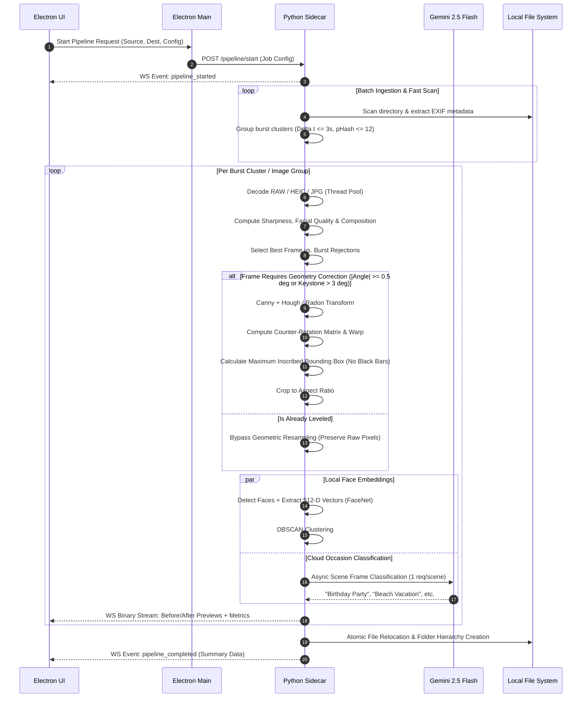

# LuminaSort — System Architecture Specification
**Document Version:** 1.0.0  
**Project:** LuminaSort (Intelligent Photo Organizer & Auto-Enhancement System)  
**Target Platform:** Windows 10/11 (x64 / ARM64)  
**Author / Engineering Team:** LuminaSort Core Architecture Team  
**Status:** Approved for Implementation  

---

## 1. System Overview & Architectural Topology

LuminaSort is structured as a **Decoupled Hybrid Desktop Architecture**. The application separates the high-performance user interface (UI) rendering and user interaction lifecycle from CPU/GPU-intensive computer vision, raw decoding, and AI inference tasks.

```mermaid
graph TB
    subgraph Client_Tier ["Frontend Presentation Layer (Electron + React)"]
        UI_Renderer["React 18 UI (Vite + TypeScript + TailwindCSS)"]
        State_Store["Zustand / TanStack Store (UI State, Queues, Metrics)"]
        IPC_Renderer["Electron IPC Renderer Bridge (contextBridge / preload)"]
        WS_Client["Local WebSocket Client (Fast Image Buffer Stream)"]
    end

    subgraph Host_Tier ["Application Host Layer (Electron Main Process)"]
        Main_Proc["Electron Main Process (Node.js 20+)"]
        Sidecar_Mgr["Sidecar Lifecycle Supervisor (Spawns, monitors, restarts Python)"]
        Native_FS["Native Dialogs & File System Access Provider"]
        Secure_Store["Encrypted Credential Store (keytar / safeStorage)"]
    end

    subgraph Sidecar_Tier ["Compute Engine Layer (Python 3.11 High-Performance Sidecar)"]
        Engine_Core["FastAPI / AsyncIO Dispatcher & Pipeline Controller"]
        IPC_Server["Local WebSocket Server (Zero-Copy Buffer Streaming)"]
        
        subgraph Pipeline_Subsystems ["Pipeline Subsystems"]
            Decoder_Pool["Ingestion & RAW/HEIC Multi-threaded Decoder"]
            Cluster_Engine["Perceptual Hash & Timestamp Burst Grouper"]
            Quality_Scorer["Laplacian & Facial Aesthetic Quality Scorer"]
            Geom_Engine["Hough / Radon Horizon & Keystone Corrector"]
            Crop_Engine["Max Inscribed Aspect-Preserving Cropper"]
            Face_Engine["FaceNet / MediaPipe Face Detection & DBSCAN"]
            Gemini_Bridge["Gemini 2.5 Flash Vision Async Client"]
            Export_Mgr["Atomic File Movement & Hierarchy Builder"]
        end
    end

    subgraph Cloud_Tier ["Cloud AI Service Layer"]
        Gemini_Cloud["Google Gemini 2.5 Flash Vision API"]
    end

    UI_Renderer <--> State_Store
    UI_Renderer <--> IPC_Renderer
    UI_Renderer <--> WS_Client
    
    IPC_Renderer <--> Main_Proc
    Main_Proc <--> Sidecar_Mgr
    Main_Proc <--> Native_FS
    Main_Proc <--> Secure_Store
    
    Sidecar_Mgr -.->|Spawns / Manages PID| Engine_Core
    WS_Client <==>|Binary Frames & Telemetry (WS / Port 52144)| IPC_Server
    
    Engine_Core --> Decoder_Pool
    Decoder_Pool --> Cluster_Engine
    Cluster_Engine --> Quality_Scorer
    Quality_Scorer --> Geom_Engine
    Geom_Engine --> Crop_Engine
    Crop_Engine --> Face_Engine
    Crop_Engine --> Gemini_Bridge
    Face_Engine --> Export_Mgr
    Gemini_Bridge --> Export_Mgr
    Gemini_Bridge <==>|HTTPS / REST Scene Batches| Gemini_Cloud
```

---

## 2. Component Breakdown & Responsibilities

### 2.1 Electron Host & Preload Bridge
* **`main/index.ts`**: Entry point for Node.js runtime. Manages OS-level window frame, hardware acceleration flags (`--enable-features=VaapiVideoDecoder`), deep-linking, system sleep prevention during active jobs (`powerSaveBlocker`), and single-instance locks.
* **`main/sidecar.ts`**: High-availability Python sidecar supervisor. Handles:
  - Dynamic port selection (detects free local port between `52000`–`52999`).
  - Child process spawning (`python.exe` / bundled PyInstaller binary with stdin/stdout piped).
  - Health checks (`/health` heartbeat every 2000ms) and automatic crash recovery with backoff.
  - Graceful teardown (sends `SIGTERM`, waits 3s, escalates to `SIGKILL` on app exit).
* **`preload/index.ts`**: Exposes secure `window.luminaAPI` via `contextBridge.exposeInMainWorld()`. Eliminates node integration in the renderer to enforce strict Chromium sandbox compliance.

### 2.2 Frontend Client Layer (React 18 + TypeScript)
* **Design Pattern**: Component-Driven Reactive State with Unidirectional Data Flow.
* **Core Modules**:
  - `src/stores/usePipelineStore.ts`: Global queue state, real-time stage progress, counters (straightened, rejected, tagged).
  - `src/stores/useConfigStore.ts`: User preferences (thresholds, dark mode, API keys, destination template rules).
  - `src/services/websocket.ts`: Binary-aware WebSocket client with auto-reconnect and frame de-serialization.
  - `src/components/dashboard/`: Real-time dual-canvas comparison viewer (Original vs. Auto-Leveled/Cropped).
  - `src/components/faces/`: Face clustering gallery with instant inline alias naming.

### 2.3 Python 3.11 Sidecar Compute Engine
* **Runtime**: Standalone embedded Python 3.11 environment with C-extension acceleration (`numpy`, `opencv-python-headless`, `scipy`, `scikit-image`, `rawpy`, `pillow-heif`, `torch/onnxruntime`).
* **Asynchronous Dispatcher (`engine/server.py`)**: Built on `asyncio` + `uvicorn` WebSocket server for event-driven IPC. Heavy compute blocks are offloaded to a dedicated `concurrent.futures.ProcessPoolExecutor`.

---

## 3. Data Processing Pipeline & Algorithmic Specifications



---

## 4. Detailed Algorithmic Specifications

### 4.1 Burst Detection & Quality Culling Engine
1. **Timestamp & Spatial Bucketing**:
   - Files are sorted chronologically by EXIF `DateTimeOriginal` (falling back to file creation timestamp if EXIF is absent).
   - A rolling window accumulates items into Burst Candidate Sets:
     $$\Delta t = |t_{i} - t_{i-1}| \le 3.0 \text{ seconds}$$
2. **Perceptual Hash Distance**:
   - 64-bit DCT pHash computed on 32x32 grayscale downsampled image.
   - Hamming distance $D_H(\text{pHash}_a, \text{pHash}_b) \le 12$ confirms burst membership.
3. **Composite Quality Scoring Function**:
   $$\text{Score}(I) = 0.40 \cdot \hat{S}_{\text{lap}} + 0.35 \cdot \hat{Q}_{\text{face}} + 0.25 \cdot \hat{C}_{\text{comp}}$$
   - **Normalized Sharpness ($\hat{S}_{\text{lap}}$)**:
     $$\text{Var}(\nabla^2 I) = \frac{1}{N}\sum ((\nabla^2 I)_{x,y} - \mu)^2$$
     Supplemented by Modified Laplacian (LAPM) to eliminate high-frequency ISO noise bias.
   - **Face Quality Score ($\hat{Q}_{\text{face}}$)**:
     $$\hat{Q}_{\text{face}} = \frac{1}{K}\sum_{k=1}^K \left(0.5 \cdot \text{EAR}_k + 0.3 \cdot (1 - \text{Blur}_k) + 0.2 \cdot \text{SmileConf}_k\right)$$
     where $\text{EAR} = \frac{\|p_2 - p_6\| + \|p_3 - p_5\|}{2 \|p_1 - p_4\|}$ (Eye Aspect Ratio).
   - **Composition ($\hat{C}_{\text{comp}}$)**:
     Weighted contrast energy, entropy of luminance histogram, and Golden Ratio / Rule of Thirds salient focal point analysis.
4. **Culling Outcome**:
   - Top 1 score: Designated `PRIMARY_ACTIVE`.
   - Remaining elements: Designated `BURST_REJECTED` (routed to `_archive/`).

---

### 4.2 Conditional Horizon & Keystone Geometry Corrector

```mermaid
flowchart TD
    Start[Input Image I] --> Gray[Convert to Grayscale & Bilateral Filter]
    Gray --> Edges[Canny Edge Detector]
    Edges --> Hough[Probabilistic Hough Line Transform]
    Hough --> FilterLines{Lines within [-45°, +45°]?}
    
    FilterLines -- No dominant lines --> Radon[Radon Transform Projection Variance]
    FilterLines -- Yes --> CalcAngle[Compute Dominant Angle θ via Length-Weighted Median]
    Radon --> CalcAngle
    
    CalcAngle --> CheckThreshold{|θ| >= 0.5° and |θ| <= 20.0°?}
    
    CheckThreshold -- False --> Bypass[Bypass Correction: Return Original Matrix]
    CheckThreshold -- True --> Rotate[Affine Rotation Matrix around Center]
    
    Rotate --> InscribedCrop[Compute Maximum Inner Inscribed Rectangle]
    InscribedCrop --> AspectFit[Fit Original Aspect Ratio w:h inside Inscribed Box]
    AspectFit --> WarpCrop[Apply cv2.warpAffine with Lanczos4 + Crop]
    
    Bypass --> Output[Pass-Through Image Buffer]
    WarpCrop --> Output
```

#### Maximum Inscribed Rectangle Algorithm (Zero Black Borders):
For an image with width $w$ and height $h$ rotated by angle $\theta \text{ rad}$:
Let $\alpha = |\theta|$. The maximum inscribed rectangle $(w', h')$ preserving the original aspect ratio $r = w/h$ is solved analytically without iterative pixel scanning:
$$w' = \frac{w \cdot h}{w \sin\alpha + h \cos\alpha}$$
$$h' = \frac{w'}{r}$$
This guarantees mathematical elimination of rotation-induced black corner padding with minimum crop loss.

---

### 4.3 Hybrid Semantic Occasion & Face Pipeline

#### A. Google Gemini 2.5 Flash Vision Integration
* **Deduplication Strategy**: Instead of executing an API call for every frame in a 500-photo burst, the system executes **1 request per clustered scene**.
* **Payload Optimization**:
  - Image is resized to $768\times 768\text{px}$ WebP (quality 80) in-memory.
  - Base64 payload transmitted via Google GenAI SDK with structured response schema:
```json
{
  "occasion": "Birthday Party",
  "setting": "Indoor Celebration",
  "confidence": 0.96,
  "suggested_tags": ["birthday", "cake", "balloons", "family"]
}
```
* **Offline / Missing Key Fallback**:
  - If the API key is not supplied or network connectivity is severed:
    `[YYYY-MM-DD]_[EXIF_City_Or_CameraModel]` (e.g., `2026-08-28_San_Francisco` or `2026-08-28_Photo_Collection`).

#### B. Local Face Embeddings & Unsupervised DBSCAN
* **Model**: ONNX-optimized FaceNet (Inception-ResNet-v1) / MediaPipe Face Mesh.
* **Extraction**: 512-dimensional normalized unit vector per detected face bounding box ($E \in \mathbb{R}^{512}, \|E\|_2 = 1$).
* **Clustering**:
  - DBSCAN with Cosine Distance metric:
    $$\text{dist}(u, v) = 1 - \frac{u \cdot v}{\|u\|_2 \|v\|_2}$$
  - $\varepsilon = 0.38$, $\text{min\_samples} = 2$.
  - Generates cluster IDs: `Cluster_001`, `Cluster_002`, ...
  - UI allows one-click mapping: `Cluster_001` $\rightarrow$ `Alice`.

---

## 5. Storage Hierarchy & File Operations Specification

### 5.1 Target Directory Layout

```text
Destination Root/
└── YYYY-MM-DD/
    └── Occasion_Name/
        ├── [Person_Name | Category]/
        │   ├── IMG_001_enhanced.jpg
        │   └── IMG_004_enhanced.jpg
        ├── Group/
        │   └── IMG_012_enhanced.jpg
        ├── Unidentified_Persons/
        │   └── IMG_020_enhanced.jpg
        ├── Scenery_Highlights/
        │   └── IMG_008_enhanced.jpg
        ├── _archive/
        │   ├── IMG_002_burst_rejected.jpg
        │   └── IMG_003_burst_rejected.jpg
        └── _originals/
            ├── IMG_001.CR3
            ├── IMG_002.CR3
            └── IMG_004.CR3
```

### 5.2 Atomic Movement & Non-Destructive Integrity Rules
1. **Source Immutability**: Source files are **never modified in-place**. Files are copied (or moved only if user explicitly configures `Move mode`).
2. **Atomic Write Protocol**: All enhanced files are written to `.tmp.[filename]` in the destination folder, flushed to disk (`os.fsync`), and renamed atomically (`os.replace`) to prevent corrupt files upon unexpected power loss.
3. **RAW Preservation**: If a RAW file is processed (`.CR3`, `.ARW`, `.NEF`), its full bit-depth original is retained in `_originals/`, and an 8-bit sRGB JPEG/WebP enhanced counterpart is placed in the curated category folder.
4. **EXIF Transposition**: All original EXIF, GPS, and timestamp tags are copied to the enhanced destination JPEG via `piexif` / `exiftool`.

---

## 6. IPC Protocol & WebSocket Data Contracts

The Electron frontend and Python sidecar communicate over a dedicated local WebSocket connection (`ws://127.0.0.1:<PORT>/ws`).

### 6.1 Message Schemas

#### Start Pipeline Command (UI $\rightarrow$ Engine):
```json
{
  "type": "CMD_START_PIPELINE",
  "payload": {
    "job_id": "job_948a2bc",
    "source_path": "D:/Photos/Wedding_Dump",
    "destination_path": "D:/Photos/Organized_Output",
    "gemini_api_key": "AIzaSy...",
    "options": {
      "auto_straighten": true,
      "straighten_threshold_deg": 0.5,
      "cull_bursts": true,
      "archive_rejected": true,
      "cluster_faces": true,
      "output_format": "JPEG",
      "jpeg_quality": 92
    }
  }
}
```

#### Real-Time Telemetry & Progress Stream (Engine $\rightarrow$ UI):
```json
{
  "type": "EVT_PROGRESS_UPDATE",
  "payload": {
    "job_id": "job_948a2bc",
    "current_index": 142,
    "total_images": 650,
    "percentage": 21.84,
    "current_file": "DSC_8921.NEF",
    "active_stage": "GEOMETRY_CORRECTION",
    "metrics": {
      "bursts_identified": 28,
      "frames_culled": 74,
      "images_straightened": 46,
      "occasions_tagged": 5,
      "faces_detected": 112
    }
  }
}
```

#### Dual Before/After Live Frame Preview (Engine $\rightarrow$ UI):
```json
{
  "type": "EVT_FRAME_PREVIEW",
  "payload": {
    "filename": "DSC_8921.NEF",
    "is_burst_winner": true,
    "rotation_applied_deg": -3.42,
    "was_straightened": true,
    "sharpness_score": 88.4,
    "occasion": "Wedding Ceremony",
    "assigned_cluster": "Person 1",
    "before_thumbnail_base64": "data:image/jpeg;base64,/9j/4AAQSkZJRg...",
    "after_thumbnail_base64": "data:image/jpeg;base64,/9j/4AAQSkZJRg..."
  }
}
```

#### Face Cluster Discovered Event (Engine $\rightarrow$ UI):
```json
{
  "type": "EVT_FACE_CLUSTERS_UPDATED",
  "payload": {
    "clusters": [
      {
        "cluster_id": "cluster_001",
        "custom_name": null,
        "sample_avatar_base64": "data:image/jpeg;base64,...",
        "occurrence_count": 34,
        "representative_photo": "DSC_8921.NEF"
      }
    ]
  }
}
```

---

## 7. Concurrency, Memory & Resource Management

| Subsystem | Strategy | Technical Specification |
| :--- | :--- | :--- |
| **RAW/HEIC Decoding** | Thread Pool Worker Queues | `concurrent.futures.ThreadPoolExecutor(max_workers=min(8, os.cpu_count()))` |
| **Heavy CV / Geometry** | Multi-Process Pool | `ProcessPoolExecutor` with pinned memory buffers to avoid GIL contention |
| **RAM Footprint Capping** | Periodic Explicit Garbage Collection | Explicit `gc.collect()` and OpenCV memory pool flushing every 50 processed images; maximum memory bounded to $\le 1.2\text{ GB}$ |
| **WebSocket Bandwidth** | Downsampled Preview Streaming | Real-time preview frames constrained to max dimension $640\text{px}$, JPEG quality 75, keeping local WS throughput under $5\text{ MB/s}$ |
| **Gemini Rate Limiting** | Token Bucket Tokenizer + Batching | Max 10 concurrent async requests; backoff with jitter on HTTP 429 status codes |

---

## 8. Security, Privacy & Sandboxing

1. **Local-First Processing Guarantee**: All computer vision, horizon straightening, burst culling, and face embedding generation are performed **100% locally on the user's CPU/GPU**.
2. **Cloud Transmission Boundary**: Only scaled down representative scene images ($768\text{px}$) are sent to the Gemini API for occasion classification. Face embeddings, biometric vectors, and RAW files **never leave the local machine**.
3. **API Key Security**: The Gemini API key is stored using Electron's `safeStorage` (Windows DPAPI hardware-backed encryption) and never written to plaintext log files.
4. **IPC Sandboxing**: Electron renderer operates with `nodeIntegration: false`, `contextIsolation: true`, and strict Content Security Policy (`default-src 'self' ws://127.0.0.1:* data: blob:`).

---

## 9. Error Handling & Failure Recovery Matrix

| Failure Mode | Trigger Scenario | Architectural Mitigation |
| :--- | :--- | :--- |
| **Corrupted RAW / Truncated File** | Incomplete copy or damaged SD card sector | `rawpy.LibRawFileUnsupportedError` caught; logged to error stream; raw file bypassed to `_unprocessed/corrupt/` without crashing pipeline. |
| **Python Sidecar Crash** | Native C++ extension SIGSEGV | Electron `SidecarSupervisor` catches child process exit; re-spawns engine; resumes job from last completed checkpoint state stored in SQLite queue. |
| **Gemini Quota Exceeded / No Internet** | HTTP 429 / ENOTFOUND | Engine gracefully downgrades to Rule-Based Date & EXIF Naming without interrupting sorting flow. |
| **Disk Space Exhaustion** | Destination drive reaches $< 500\text{MB}$ | Engine pauses pipeline; broadcasts `EVT_DISK_FULL_PAUSE` to UI; allows user to free space and resume. |
